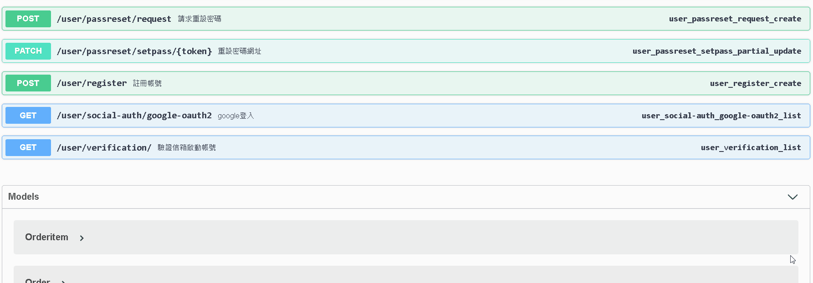
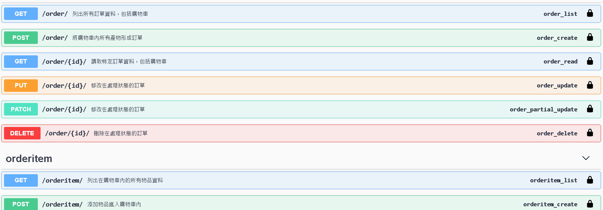

# **shop-app-api-demo**

前端

https://www.djangoshopdemo.net/
 

後端
https://www.djangoshopdemo.net/swagger
 架設於AWS的購物車API，以swagger document形式呈現。
 
 

### **目前功能**
  - 發信功能 (Celery + Redis + Gmail)
  - 註冊，發送驗證信，點擊信中地址啟動帳號
  - 請求修改密碼功能，請求後發送修改地址信，點擊信中地址來到修改密碼頁面 
  - google社群登入
  - 產品搜尋以及分頁
  - JWT驗證 (djangorestframework-simplejwt)
  - 加入產品到購物車內，並提交訂單
  - 提交訂單後，發送確認電子郵件給客戶
  - 部署 (AWS + Docker + uWSGI + NGINX)

### **使用工具**
 - VueJs
 - Django rest framework
   - drf_yasg
   - Celery 
   - djangorestframework-simplejwt
   - uwsgi
 - Redis 
 - Docker
 - NGINX
 - AWS

### **功能**

swagger中，部分api需要authorization才可使用，這類api右側都帶有鎖符號。 先去/token/裡，輸入username, password可得accessc, refresh token。
點擊頁面右上角 Authorize按鈕，輸入 "Bear " + 剛剛獲得的access token 如下圖，即可使用需要authorization的api。

**請求修改密碼**
 
輸入帳號名、該帳號註冊的email地址，即送出到密碼重置信。信中地址回傳修改密碼的token至前端，之後會一併和用戶修改後的密碼一起送出給後端。在此使用後端的介面，直接輸入token和密碼。

**Google第三方登入**
 
通常現成的package功能較多，但也比較複雜，有時也不能銜接自己的user model，個人選擇自己建立。 

1.一開始先準備和google api註冊redirect_uri，得到client_id, client_secrets。 

2.在前端放著google登入口的連結，連結以query string方式加上client_id, redirect_uri...等參數，用戶點擊時頁面會轉到google登入口。 

3.在用戶完成登入時，google會將auth_code為主的參數以GET加上query string方式回傳到步驟1.的redirect_uri地址。 

4.在該redirect_uri地址的前端取出query string中的auth_code，以回傳至後端。 

5.後端將auth_code以及步驟1.得到的client_secrets等參數以POST方式傳至google。

6.google回傳用戶所授權的用戶資料至後端。 

7.後端儲存並搜尋用戶資料，回傳jwt token給前端，用戶可以使用jwt token的權限。

**訂單功能**

購物車功能，包括加入個別商品至購物車中、將購物車內商品轉成訂單並且發信通知、刪除訂單......等等。下圖僅呈現取出購物車和訂單的資料為例。

## **使用前置**

 prod.py中的allowed_host, site_url。

 重要密碼皆在secrets_example.py，密碼修改後將名稱修改為secrets.py，切勿上傳至github。重要密碼除了secrets_example.py外，其以下對應處也需修改:

1.DATABASE_USER, DATABASE_PASSWORD: docker-compose.yml

2.CACHES_PASSWORD: compose/redis/redis.conf

3.SOCIAL_AUTH_KEY, SOCIAL_AUTH_SECRET: https://console.developers.google.com/apis, https://developers.facebook.com/

4.EMAIL_HOST_USER, EMAIL_HOST_PASSWORD: https://myaccount.google.com/security
