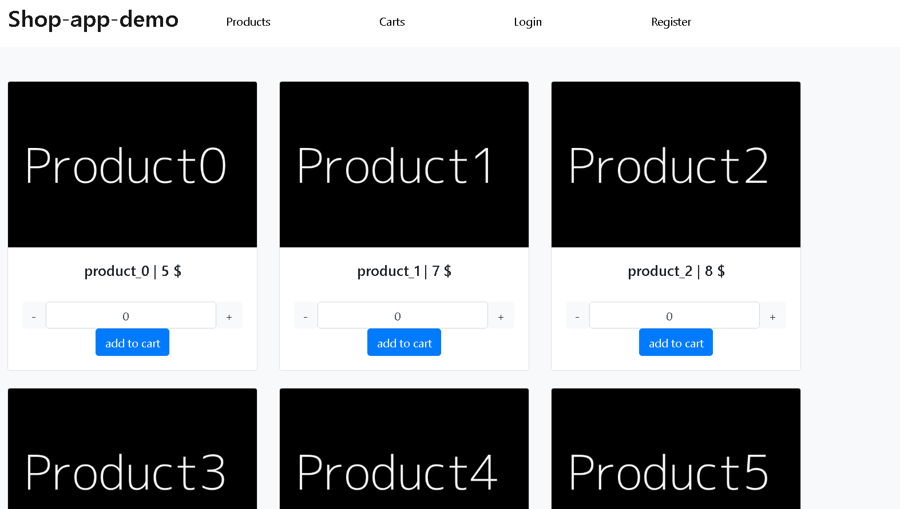
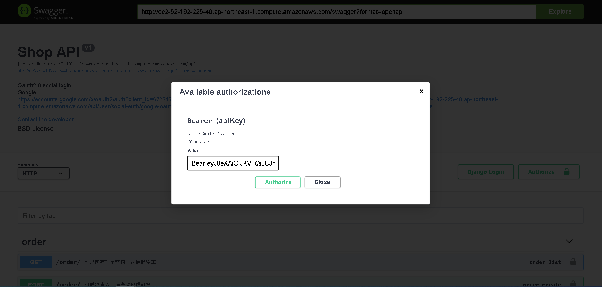
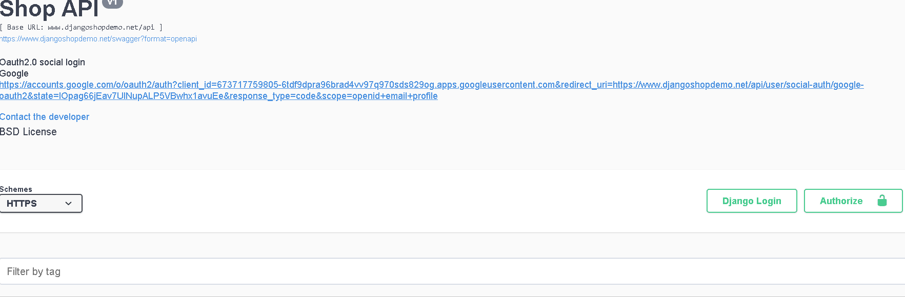
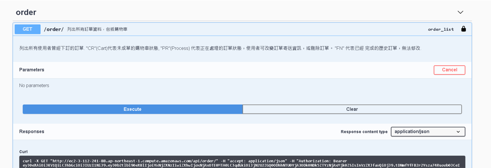

# **shop-app-api-demo**

前端

https://www.djangoshopdemo.net/
 

後端
https://www.djangoshopdemo.net/swagger
 架設於AWS的購物車API，以swagger document形式呈現。
 
 

### **目前功能**
  - 發信功能 (Celery + Redis + Gmail)
  - 註冊，發送驗證信，點擊信中地址啟動帳號
  - 請求修改密碼功能，請求後發送修改地址信，點擊信中地址來到修改密碼頁面 
  - google社群登入
  - 產品搜尋以及分頁
  - JWT驗證 (djangorestframework-simplejwt)
  - 加入產品到購物車內，並提交訂單
  - 提交訂單後，發送確認電子郵件給客戶
  - 部署 (AWS + Docker + uWSGI + NGINX)

### **使用工具**
 - VueJs
 - Django rest framework
   - drf_yasg
   - Celery 
   - djangorestframework-simplejwt
   - uwsgi
 - Redis 
 - Docker
 - NGINX
 - AWS

### **功能**

swagger中，部分api需要authorization才可使用，這類api右側都帶有鎖符號。 先去/token/裡，輸入username, password可得accessc, refresh token。
點擊頁面右上角 Authorize按鈕，輸入 "Bear " + 剛剛獲得的access token 如下圖，即可使用需要authorization的api。

 請求修改密碼

>  1 送出密碼修改請求

>  2 寄送密碼修改網址至用戶信箱

>  3 修改密碼

>  4 用新密碼請求jwt token

Google第三方登入

訂單功能

## **使用前置**

 prod.py中的allowed_host, site_url。

 重要密碼皆在secrets_example.py，密碼修改後將名稱修改為secrets.py，切勿上傳至github。重要密碼除了secrets_example.py外，其以下對應處也需修改:

1.DATABASE_USER, DATABASE_PASSWORD: docker-compose.yml

2.CACHES_PASSWORD: compose/redis/redis.conf

3.SOCIAL_AUTH_KEY, SOCIAL_AUTH_SECRET: https://console.developers.google.com/apis, https://developers.facebook.com/

4.EMAIL_HOST_USER, EMAIL_HOST_PASSWORD: https://myaccount.google.com/security
